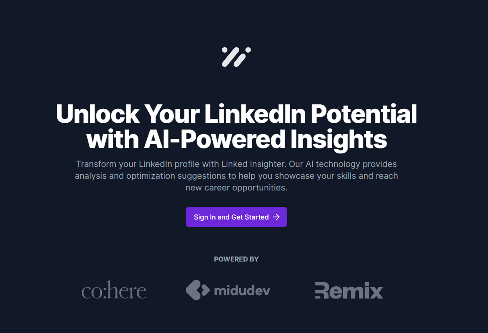
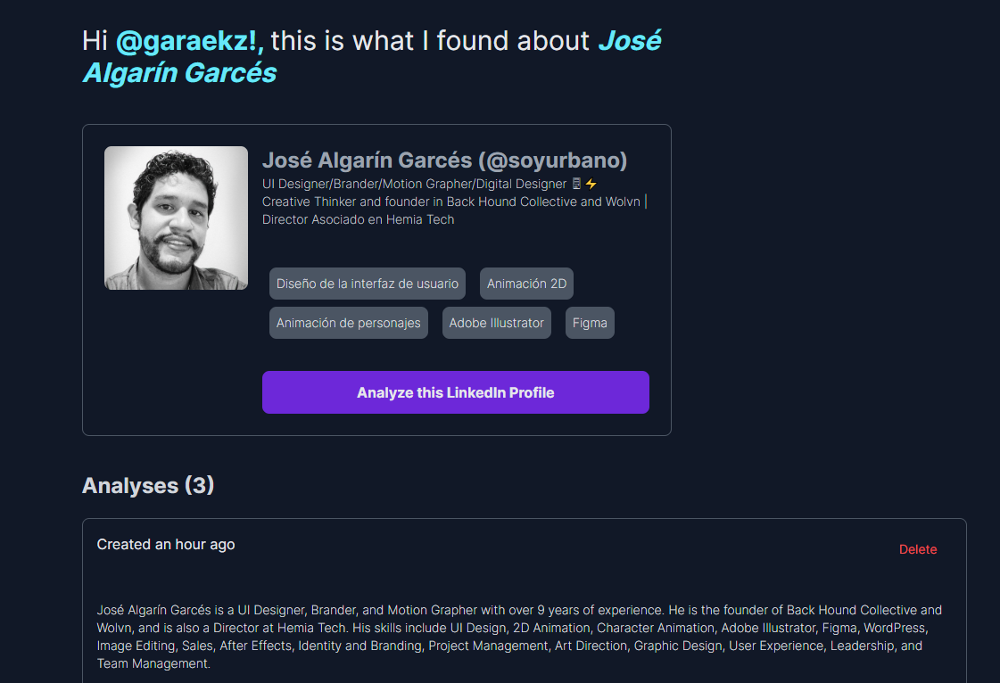

# Linked Insighter - Giving AI powered insights of your profiles

Este proyecto fue creado específicamente para participar en el Hackathon de [@midudev](https://github.com/midudev) usando Cohere para la IA. Aunque no ganó nos quedamos con un buen proyecto, funcional y realizado completamente en unas 40 horas de las cuales 30~36 se realizaron sin descanso y sin dormir.

El proyecto es mostrado como un producto innovador, se trabajó mucho ese look de producto pero recuerden que solamente es un proyecto para una hackathon, también a considerar que está en inglés y esto es intencional, era necesario mantener la consistencia con las respuestas de la IA y la utilizada no responde bien en multi lenguajes.

Si les gustó el proyecto no olviden dejar una estrellita ⭐🌟✨ No les cuesta nada, no sirve de nada pero me ayuda a saber si les gustó y mantener mejor mis proyectos con nuevos updates.

## 🗃 Tabla de contenidos
- [Overview](#-overview)
- [El reto](#-el-reto)
- [Screenshots](#-screenshots)
- [Demo](#-demo)
- [¿Qué y cómo lo hice?](#-qué-y-cómo-lo-hice-inteligencia-artificial)
- [Tech Stack](#-tech-stack)
- [Aprendizaje](#-aprendizaje)
- [Autor](#-autor)

## ✨ Overview

### 🏆 El reto
Era necesario utilizar [co:here](https://cohere.ai/) como motor de inteligencia artificial, no había limites en el proyecto más allá de que sea web, que esté el repo público y que tengamos un demo desplegado.
Yo elegí reutilizar un repo que tenía apenas iniciado con autenticación social (esto fue realizado antes de que existiera el hackathon), ¿mi reto principal? nunca había realizado un proyecto con [Remix](https://remix.run/)... Well, bring it on!

### 📸 Screenshots

### 💻 Demo
- Pueden ver el sitio funcionando acá: [https://linked-insighter.fly.dev/](https://linked-insighter.fly.dev/)

## 🤖 ¿Qué y cómo lo hice? Inteligencia Artificial
Tuve la idea (ayudado por ChatGPT para decidirme entre ideas) de ayudar a reclutadores y a devs por igual, a mi me llegan todo el tiempo propuestas laborales, no necesito, tengo conocidos que no les llega nada y lo necesitan. Me he dado cuenta que lo que contenga tu perfil dice mucho a los que buscan cubrir puestos de IT.

Me puse manos a la obra, reutilicé un repo apenas inicializado con autenticación social, eliminé todo lo innecesario, me quedé con lo necesario y me puse a trabajar. Fue un rush de unas 32-36 sin dormir, con mucho café y mucha emoción. Era parte de las reglas usar la IA de [co:here](https://cohere.ai/) , bueno, resulta que su API es muy *(muuuuuuuuuuuuuuuuuy)* lenta para lo que lo necesitaba y algunas veces retornaba solamente basura, fue necesario reformular mi flujo para intentar contener ese problema, también fue necesario jugar mucho con las configuraciones para que la IA respondiera coherentemente.

Al final no fue lo que esperaba, en algunos aspectos fue mucho mejor, en otros mi falta de know how en el framework fueron limitantes pero al final resultó algo superando algo solamente "Bueno".

### ⚡ Tech Stack
- Typescript - Fue uno de los motivos por los que decidí utilizar Remix.
- [Remix](https://remix.run/) - La base de todo
- [React](https://reactjs.org/) Remix es un framework de React
- [TailwindCSS](https://tailwindcss.com/) - Estilitos
- [Prisma](https://prisma.io/) - ORM
- [PostgreSQL](https://www.postgresql.org/) - Base de datos
- [co:here](https://cohere.ai/) - El motor de IA
- [headlessui](https://headlessui.com/) - El tiempo era esencial
- [Flowbite](https://flowbite.com/) - De nuevo, tiempo, me quitó algo de peso en componentes limitados

### 🤓 Aprendizaje
Bueno, si competiste y no aprendiste entonces no valió la pena. No gané, incluso fui pasado de largo en lo genérico, sé que el proyecto no es sorprendente, super creativo o revolucionario, el proyecto es lo que es, es una herramienta, la intención es ser usada para mejorar tu perfil de LinkedIn siguiendo las indicaciones de la IA, darte cuenta de tus carencias y fortalezas en el perfil, recibir recomendaciones de como mejorarlo.

## 🐱‍💻 Autor
 - David Garay 🏴‍☠️🔥
 - Facebook  - [David Garay](https://www.facebook.com/Garaeks)
 - Twitter - [@garaekz](https://www.twitter.com/garaekz)

### Soy Un Dev
Tengo mi proyecto descuidado pero si quieren pueden visitar
 - Facebook - [@soyundev](https://facebook.com/soyundev)
 - Instagram - [@soyundev](https://instagram.com/soyundev)
 - Twitter - [@soyeldev](https://twitter.com/soyeldev)

